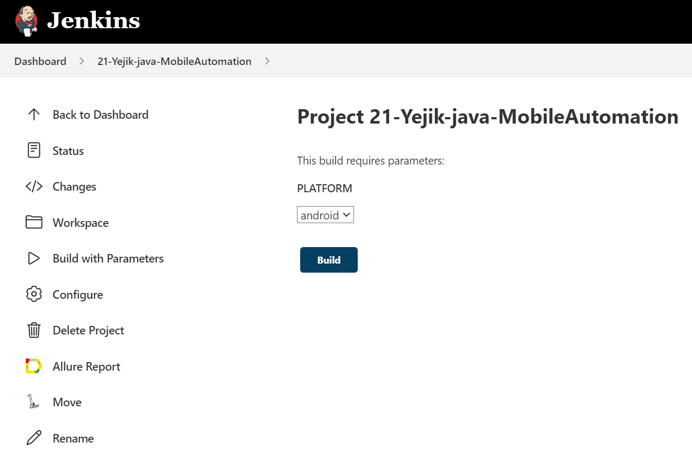
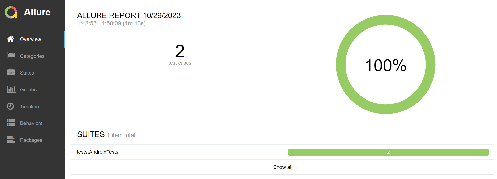
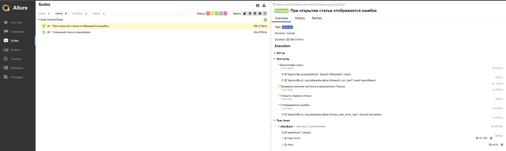

# Проект по автоматизации тестовых сценариев для приложения Wikipedia
## :pushpin: Содержание:

- [Использованный стек технологий](#computer-использованный-стек-технологий)
- [Запуск автотестов](#arrow_forward-запуск-автотестов)
- [Сборка в Jenkins](#jenkins)
- [Пример Allure-отчета](#allure)
- [Уведомления в Telegram с использованием бота](#telega)
- [Видео примера запуска тестов в Selenoid](#Видео-запуска-тестов-в-Selenoid)

## :computer: Использованный стек технологий

<p align="center">


</p>

## 🏁 Реализованные проверки:

### При запуске локально (local) на эмуляторе:

- Проверка появления результатов поиска при выдаче
- Проверка 4 стартовых страниц wiki
- Проверка присутствия кнопки логина на странице при переходе через edits
- Проверка поиска конкретной статьи
- Проверка добавления и удаления языка

### При запуске удаленно (remote) на Browserstack:

- Проверка появления результатов поиска при выдаче
- Проверка поиска
- Проверка выдачи валидной статьи при поиске
- Добавление языка

## :arrow_forward: Запуск автотестов

### Запуск тестов на локальном эмуляторе
```
gradle clean emulation_test -DdeviceHost=emulation
```
### Запуск тестов на удаленном устройстве через Browserstack
```
gradle clean ios_test -DdeviceHost=ios
gradle clean android_test -DdeviceHost=android
```
При выполнении команды, тесты запустятся удаленно в <code>Browserstack</code>.

##  <a href="https://jenkins.autotests.cloud/job/21-Yejik-java-TinkoffWebTests" target="blank">Сборка в Jenkins</a>

<p align="center">

</p>

### Параметры сборки

* <code>PLATFORM</code> – мобильная платформа, на которой выполняются тесты. По-умолчанию - <code>android</code>.

##  <a href="https://jenkins.autotests.cloud/job/21-Yejik-java-MobileAutomation/9/allure/" target="_blank">Пример Allure-отчета</a>

Содержание Allure-отчета:
* Шаги теста;
* Page Source;
* Видео выполнения автотеста.

### Overview

<p align="center">

</p>

### Результат выполнения теста

<p align="center">

</p>

<a id="movie"></a>
## </a> Видеопример выполнения теста Browserstack

____
<p align="center">
   
</p>
